# E-Voting App

Role-based online voting system built with Next.js, Prisma, and PostgreSQL.

## Live Access

- App URL: https://ssc-e-voting.vercel.app/

## Admin Access

For admin access requests, email: `kennethdean08@gmail.com`

## App Overview

This application is designed to run student/organization elections with two clear roles:

- `VOTER`: reviews active elections, checks candidates per position, submits one ballot, and monitors vote history/results.
- `ADMIN`: configures elections, manages candidates/partylists/positions, manages users, and monitors system health + audit logs.

The app focuses on election integrity, simple voter UX, and operational visibility for administrators.

## What This App Does

- Handles end-to-end election setup and voting in one platform.
- Prevents duplicate voting for the same election/position.
- Supports election lifecycle states (`PENDING`, `SCHEDULED`, `ONGOING`, `PAUSED`, `COMPLETED`, `STOPPED`).
- Provides role-aware pages and protected routes.
- Tracks important admin actions in immutable audit logs.

## App Flow

### 1. Authentication and Role Access

- User signs in.
- System resolves role (`VOTER` or `ADMIN`).
- User is routed to role-specific pages/features.

### 2. Voter Flow

- Open `Vote List` and see active elections.
- Open an election and review candidates by position.
- Select candidates position-by-position.
- Review vote receipt summary.
- Submit ballot once.
- View vote history, rankings, and results pages.

### 3. Admin Flow

- Create or manage elections.
- Configure positions, partylists, and candidates.
- Monitor dashboard and system status.
- Manage user roles and election-related records.
- Review audit logs for operational transparency.

## Key Features

- Role-based authorization (`ADMIN` / `VOTER`)
- Election management and status transitions
- Candidate management (add/edit/delete)
- Position-based ballot submission
- Vote receipt summary before final submit
- Vote history for voters
- Result and ranking views
- Admin dashboard + system status health checks
- Audit logging for critical admin operations
- Profile update and password update dialogs

## App Preview

App preview images are stored in `/public/app-preview` and show key voter and admin screens.

### Summary

- Covers the full journey: election listing, voting, results, rankings, and admin operations.
- Includes governance views: user management, audit logs, and system status.
- Demonstrates both voter-facing UX and admin control panels.

### Preview Gallery

1. Landing page - entry point and app introduction

2. Login page - user authentication access

3. Register page - first-time user onboarding

4. Voter vote list page - active elections overview
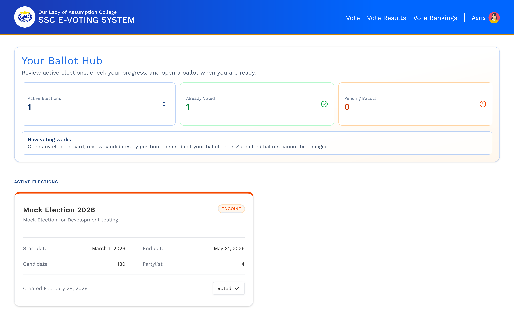

5. Election ranking page - active election standings
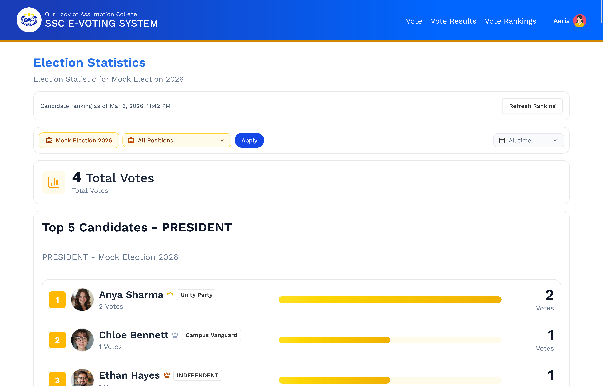

6. Election result page - winners and final outputs
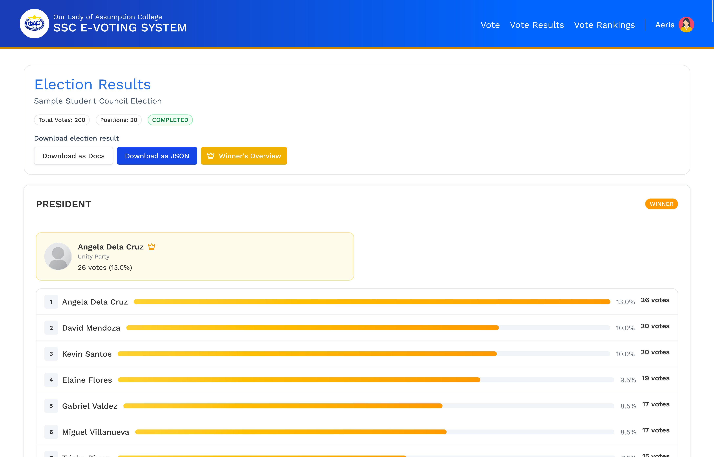

7. Admin dashboard - high-level operational summary
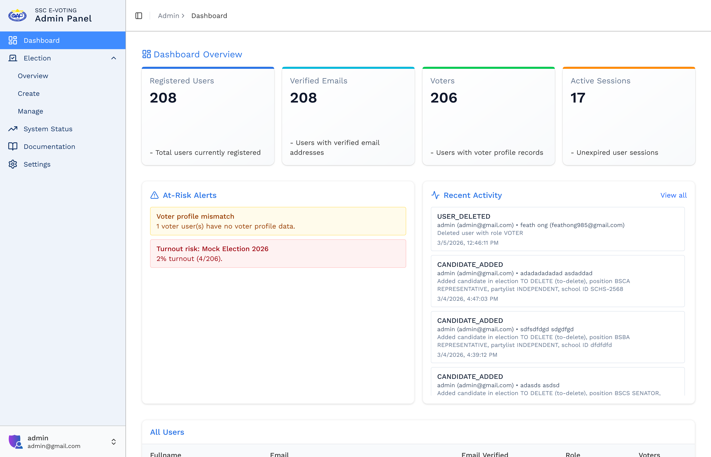

8. Create election page - start a new election cycle
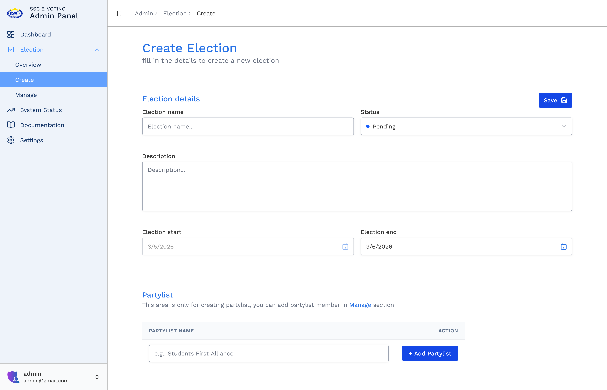

9. Manage election list page - browse and open election records
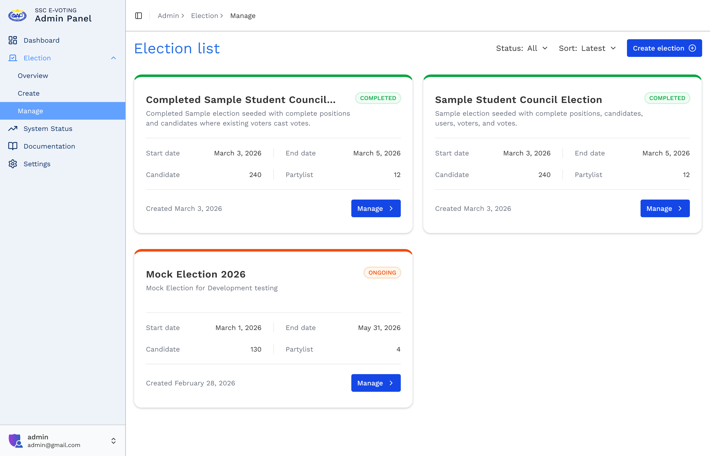

10. Manage election page - configure positions, candidates, and partylists
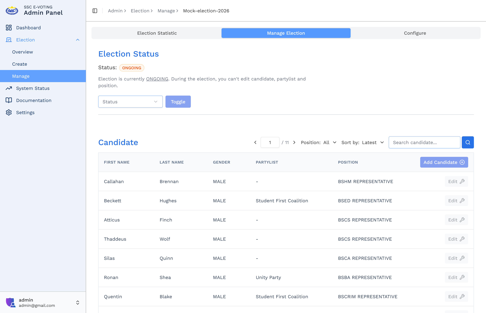

11. Election overview page - detailed election configuration summary
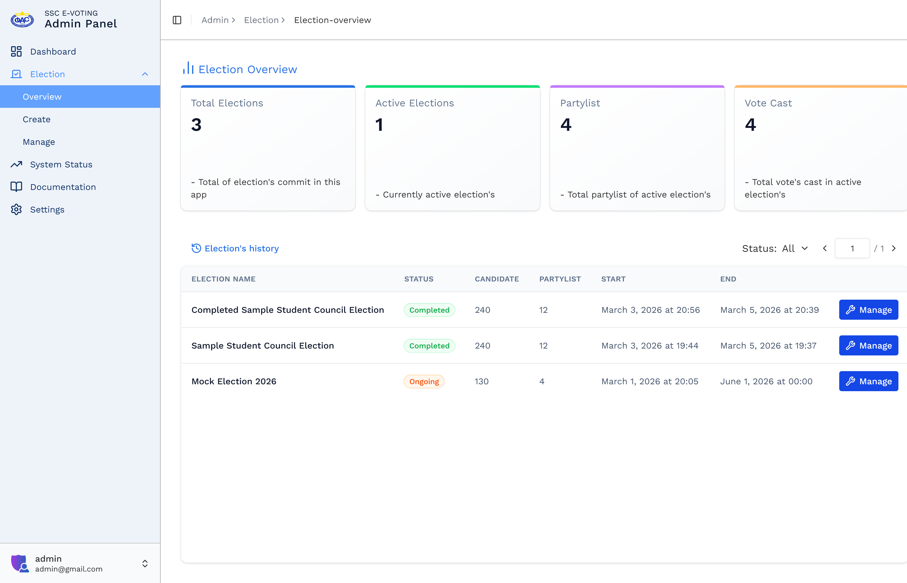

12. Settings user management - role and account administration
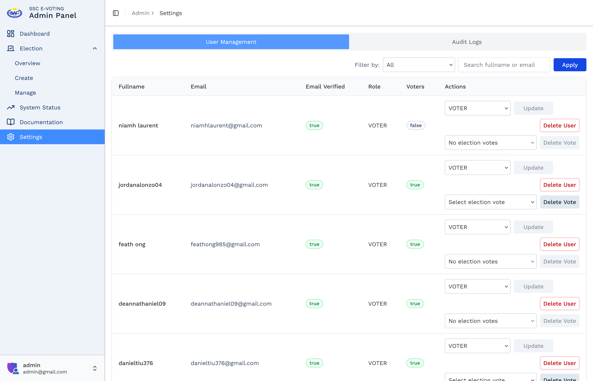

13. Settings audit logs - immutable action tracking
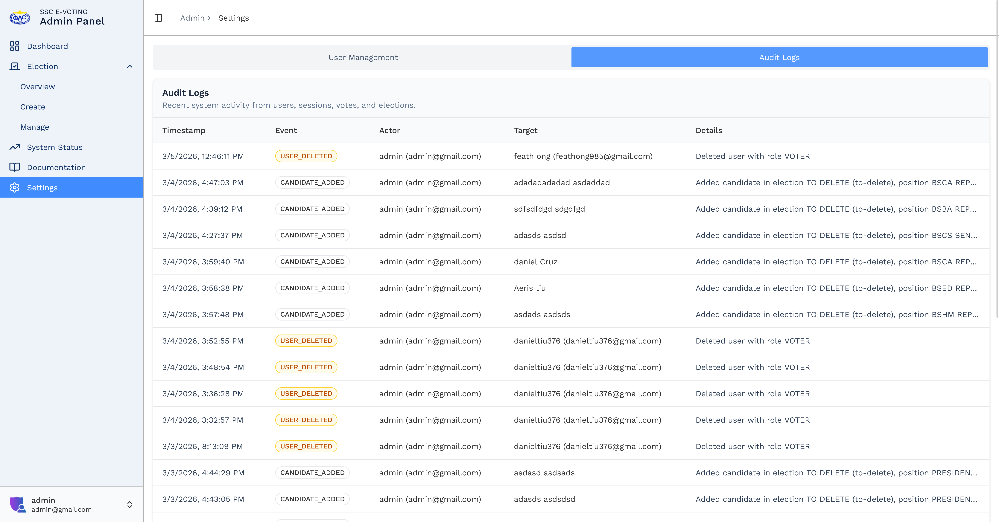

14. System status page - app/database/auth health checks
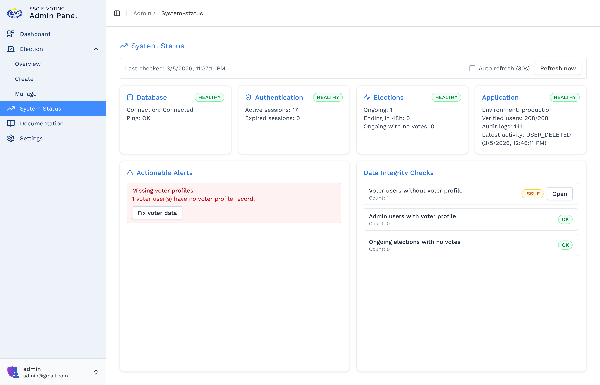

## Tech Stack

- Next.js (App Router)
- TypeScript
- Prisma ORM
- PostgreSQL
- React Hook Form + Zod
- Shadcn UI / Radix UI
- ImageKit (image uploads)

## Project Structure (Important Paths)

- `src/app/(voter)/vote` - voter election list
- `src/app/(voter)/vote/[electionId]` - election voting page
- `src/features/voters/_component/VotingComponent.tsx` - voting interaction logic
- `src/app/admin/dashboard` - admin dashboard
- `src/app/admin/election` - election management pages
- `src/app/admin/system-status` - system checks and alerts
- `src/features/admin/_components/settings/AuditLogsPanel.tsx` - audit logs UI

## Voting Integrity Rules

- User must be authenticated.
- Voter profile must exist before voting.
- Ballot submission is validated server-side.
- Duplicate and invalid vote payloads are rejected.
- Re-voting the same election is blocked.
